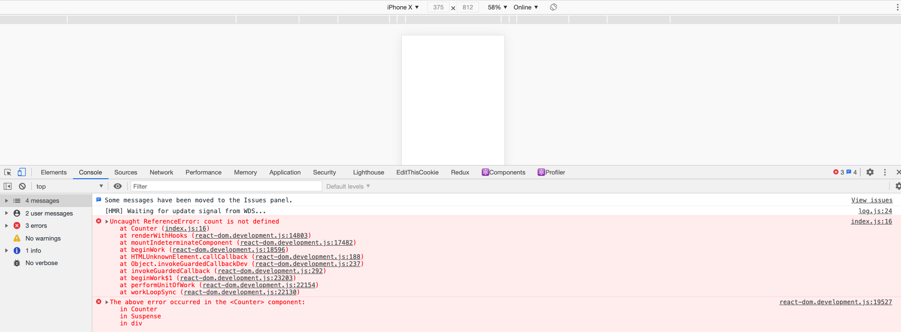
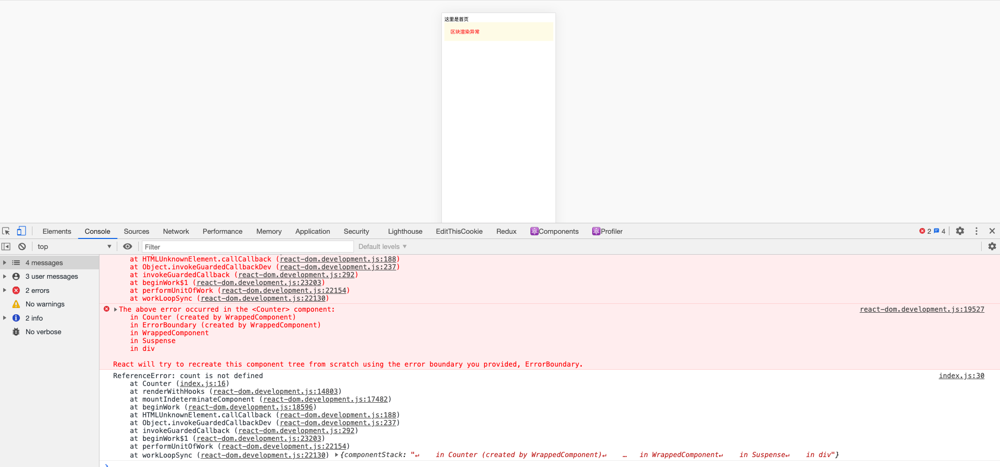

# React 异常处理

## 前言
相信大多数开发者在写 React 的时候，都遇到过以下问题，由于子组件执行异常，导致整个页面白屏



如果这种问题出现在生产环境，影响范围将是致命的，我们期望的是，尽可能减少错误的影响范围。例如某个模块异常后，页面的其他模块可以正常展示，不影响用户的正常使用

## Error Boundaries
 React 16 引入了 错误边界的概念，错误边界是 React 组件，它可以 在子组件树的任何位置捕获 JavaScript 错误，记录这些错误，并显示一个备用 UI ，而不是使整个组件树崩溃

## 封装一个高阶组件用来包裹组件

**ErrorBoundary.js**

```js
import React from 'react';

const styles = {
  error: {
    padding: '20px',
    color: 'red',
    backgroundColor: 'rgba(251, 245, 180, 0.3)',
  },
};

class ErrorBoundary extends React.Component {
  constructor(props) {
    super(props);
    this.state = { hasError: false };
  }

  static getDerivedStateFromError() {
    return { hasError: true };
  }

  componentDidCatch(error, errorInfo) {
    // TODO 错误异常上报 接入监控
    console.log(error, errorInfo);
  }

  render() {
    if (this.state.hasError) {
      return <div style={styles.error}>区块渲染异常</div>;
    }

    return this.props.children; // eslint-disable-line
  }
}

// 封装 HOC 组件 用于组件包裹
export default function ErrorBoundaryHOC(Component) {
  return class WrappedComponent extends React.Component {
    render() {
      return (
        <ErrorBoundary>
          <Component {...this.props} {...this.state} />
        </ErrorBoundary>
      );
    }
  };
}

```

**Counter.js 倒计时组件**

```js
import ErrorBoundaryHOC from 'ErrorBoundary.js';

function Counter(){
    ...
}

export default ErrorBoundaryHOC(Counter);

```

这样使用我们封装的高阶组件，将子组件包裹之后，出现异常后都不会直接使页面奔溃，效果如下：




## 异常上报

在 componentDidCatch 中我们可以通过接入监控，上报出错的组件相关信息

## 总结
通过 ErrorBoundaryHOC 包裹子组件，能够最小颗粒度的控制组件错误影响范围，降低页面崩溃概率。配合监控上报，能够很快定位到异常组件，大大增强了代码的健壮性