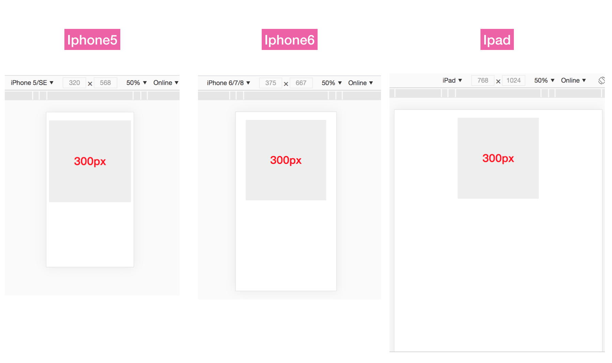

# 移动端适配方案


## 1、背景
最近需要做 H5 项目开发，之前一直在做 PC 和 小程序项目 为此去研究了下 H5 端如何做屏幕适配的。


## 2、为什么要做屏幕适配

通常设计师会给到开发者一个固定尺寸的稿子，比如 375px。如果开发者按照稿子标准的 px 单位进行开发，那么恭喜你 在iphone6(屏幕375px) 下能够完美的展示，但是在其他尺寸的屏幕下展示就出现了问题

 我们来看一下这一段 css 在不同屏幕下的展示效果

```css
.container {
  width: 300px;
  height: 300px;
  margin: 30px auto 0 auto;
  text-align: center;
  font-size: 40px;
  font-weight: bold;
  color: red;
  background-color: #eee;
}
```



实验结果可以看到 iphone6 下由于尺寸是和稿子一样的，所以展示完美。而偏小的 iphone5 间距太小，而偏大的 ipad 则间距过大。内容区域则是相同的300px，看起来十分不协调。


所以屏幕适配主要是为了让设计师的稿子，在不同屏幕尺寸下都能比较合适的还原，避免出现上诉的各种不协调问题。


## 3、业界主流的方案

### 3.1 [flexible方案](https://github.com/amfe/lib-flexible)

### 3.2 rem

### 3.3  vw

vw : 视窗宽度的 1%

上诉的 flexible 核心是通过javascript 来模拟 vw 特性，从Android4.4、Ios8 开始 已经完全支持 vw 所以我们能够在移动端开始使用 vw 进行布局。（数据来源[caniuse](https://caniuse.com/?search=vw)）


通过 vw 进行布局，将页面 px 换算未 vw 单位，这样便和不同手机的屏幕尺寸关联起来了。

可以通过以下function 进行 px-vw 转换 

```css
//iPhone 6尺寸作为设计稿基准
$vw_base: 375; 
@function vw($px) {
    @return ($px / 375) * 100vw;
}
```


那么上面的内容 demo 区域的 300px 通过上诉函数可以计算得到以下样式：

```css
.container {
  width: 80vw;
  height: 80vw;
  margin: 8vw auto 0 auto;
  background-color: #eee;
  text-align: center;
  color: red;
  font-size: 10.66vw;
  font-weight: bold;
} 

```


效果如下图所示：


采用 vw  布局后，整体的布局已经变得很和谐了，只是 ipad 上面看起来有点像老年字体。 

